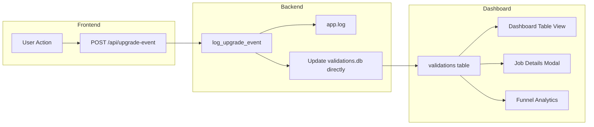

# Upgrade Flow Architecture Documentation

> [!IMPORTANT]
> This document consolidates all upgrade flow tracking into a single authoritative reference.  
> **Epic:** [citations-jk86](bd://citations-jk86)

---

## Table of Contents

1. [Current State Analysis](#current-state-analysis)
2. [Vision: Single Flat Table](#vision-single-flat-table)
3. [Impact Analysis: UPGRADE_EVENT Table Removal](#impact-analysis-upgrade_event-table-removal)
4. [Migration Plan](#migration-plan)
5. [Test Coverage Strategy](#test-coverage-strategy)

---

## Current State Analysis

### The Upgrade Funnel (4 States)

Users progress through 4 states, displayed as icons in the dashboard:

| State | Icon | Trigger | Current Log Format |
|-------|------|---------|-------------------|
| **locked** | 🔒 | Backend returns partial results | Log line: `"Job X: Completed - free tier limit reached, returning locked partial results"` |
| **clicked** | 🛒 | User clicks "Upgrade to Unlock Now" | `UPGRADE_WORKFLOW: job_id=X event=clicked_upgrade` |
| **modal** | 💳 | User selects product & redirects to Polar | `UPGRADE_WORKFLOW: job_id=X event=modal_proceed` |
| **success** | ✅ | Purchase confirmed | `UPGRADE_WORKFLOW: job_id=X event=success` or `event=purchase_completed` |

### Current Databases (3 Separate)

| Database | Path | Purpose | Tables |
|----------|------|---------|--------|
| **credits.db** | `backend/credits.db` | User balances, passes, orders | `users`, `user_passes`, `daily_usage`, `orders`, `UPGRADE_EVENT` |
| **validations.db** | `dashboard/data/validations.db` | Dashboard job tracking | `validations` |
| **app.log** | `/opt/citations/logs/app.log` | Event logs (parsed by cron) | N/A |

### Current Tracking Systems (3)

#### 1. UPGRADE_WORKFLOW (Simple) — Dashboard State

**Purpose:** Track funnel progression for dashboard icons

**Where logged:** `app.py` → `log_upgrade_event()` → app.log

**Format:**
```
UPGRADE_WORKFLOW: job_id=abc-123 event=clicked_upgrade
```

**Parsed by:** `log_parser.py` → `extract_upgrade_workflow_event()` → updates `upgrade_state` column in validations.db

**Limitation:** Currently only stores `upgrade_state` (CSV of states) without variant, product_id, amount_cents

---

#### 2. UPGRADE_WORKFLOW (Rich) — Analytics

**Purpose:** Track A/B test conversion metrics with financial data

**Where logged:** `app.py` → `log_upgrade_event()` → app.log (but with more fields)

**Format:**
```
UPGRADE_WORKFLOW: job_id=X event=checkout_started token=12345678 variant=1 product_id=prod_credits_500 amount_cents=499
```

**Parsed by:** `analytics.py` → `parse_upgrade_events()` → returns funnel metrics aggregated by variant

**Limitation:** Data is ephemeral (log files rotate), not queryable from dashboard

---

#### 3. UPGRADE_EVENT Table (Testing Only)

**Purpose:** Allow E2E tests to verify events without parsing logs

**Where written:** `app.py` → `log_upgrade_event()` → SQLite when `TESTING=true`

**Schema:**
```sql
CREATE TABLE UPGRADE_EVENT (
    id INTEGER PRIMARY KEY AUTOINCREMENT,
    user_id TEXT,
    event_type TEXT,
    timestamp INTEGER,
    experiment_variant TEXT,
    product_id TEXT,
    amount_cents INTEGER,
    metadata TEXT
)
```

**Users:**
- `/test/get-events` → returns events for a user_id
- `/test/clear-events` → clears events for a user_id
- `/test/reset-user` → includes clearing events

**Problem:** Duplicates data between logs and database; creates test-only code paths

---

## Vision: Single Flat Table

### Goal

**One table to rule them all:** The `validations` table should contain everything needed for:
1. Dashboard job list
2. Job details modal
3. Funnel analytics

### Proposed Schema Extension

Add these columns to `validations` table:

```sql
ALTER TABLE validations ADD COLUMN upgrade_state TEXT;      -- Already exists
ALTER TABLE validations ADD COLUMN experiment_variant TEXT; -- '1' or '2'
ALTER TABLE validations ADD COLUMN product_id TEXT;         -- 'prod_credits_500', 'prod_pass_7day', etc.
ALTER TABLE validations ADD COLUMN amount_cents INTEGER;    -- Purchase amount
ALTER TABLE validations ADD COLUMN checkout_completed_at TIMESTAMP;
ALTER TABLE validations ADD COLUMN purchase_order_id TEXT;  -- For linking to orders table
```

### Data Flow (After Migration)



### Benefits

1. **Single source of truth** - No log parsing needed for analytics
2. **Real-time updates** - Dashboard shows live data
3. **Queryable history** - No log rotation concerns
4. **Test simplification** - Tests query same table as production
5. **Dashboard enrichment** - Job modal can show variant, product, revenue

---

## Impact Analysis: UPGRADE_EVENT Table Removal

### Files Using UPGRADE_EVENT Table

#### Backend (Database Operations)

| File | Lines | Usage |
|------|-------|-------|
| [database.py](file:///Users/roy/Documents/Projects/citations/backend/database.py#L112-L124) | 112-124 | Creates table in `init_db()` |
| [app.py](file:///Users/roy/Documents/Projects/citations/backend/app.py#L679-L694) | 679-694 | Writes to table in `log_upgrade_event()` |
| [test_helpers.py](file:///Users/roy/Documents/Projects/citations/backend/test_helpers.py#L171-L200) | 171-200 | `/test/get-events`, `/test/clear-events`, `/test/reset-user` |

#### Backend Tests (Log Parsing)

| File | Lines | Usage |
|------|-------|-------|
| [test_webhook_direct.py](file:///Users/roy/Documents/Projects/citations/backend/test_webhook_direct.py#L106-L113) | 106-113 | Checks log output for `UPGRADE_EVENT` |
| [test_webhook_simple.py](file:///Users/roy/Documents/Projects/citations/backend/test_webhook_simple.py#L101) | 101 | Checks log output |
| [test_webhook_tracking.py](file:///Users/roy/Documents/Projects/citations/backend/test_webhook_tracking.py#L64-L69) | 64-69 | Checks log output |
| [test_analytics.py](file:///Users/roy/Documents/Projects/citations/backend/test_analytics.py#L25-L32) | 25-32 | Sample log data for parsing |
| [verify_upgrade_events.py](file:///Users/roy/Documents/Projects/citations/backend/tests/verify_upgrade_events.py) | Multiple | Log verification script |

#### E2E Tests (API Calls)

| File | Lines | Usage | **Migration Needed** |
|------|-------|-------|---------------------|
| [pricing-integration.spec.js](file:///Users/roy/Documents/Projects/citations/frontend/frontend/tests/e2e/pricing-integration.spec.js#L449-L556) | 449-556 | Uses `/test/get-events` and `/test/clear-events` | ✅ **YES** |

### Detailed E2E Test Analysis

The `tracking events fire throughout user journey` test in `pricing-integration.spec.js`:

1. **Line 449:** Calls `/test/clear-events` to reset user's events
2. **Line 477:** Calls `/test/get-events` to verify `pricing_table_shown` event
3. **Line 505, 552:** Calls `/test/get-events` to verify `checkout_started` and `purchase_completed` events

**This test MUST be migrated** before removing the UPGRADE_EVENT table.

---

## Migration Plan

### Phase 1: Extend validations Table Schema

Add columns to store upgrade analytics data:

```sql
-- Run on dashboard/data/validations.db
ALTER TABLE validations ADD COLUMN experiment_variant TEXT;
ALTER TABLE validations ADD COLUMN product_id TEXT;
ALTER TABLE validations ADD COLUMN amount_cents INTEGER;
ALTER TABLE validations ADD COLUMN checkout_completed_at TEXT;
ALTER TABLE validations ADD COLUMN token TEXT;
```

**Files to update:**
- `setup_test_validations_db.py` - Add columns to test schema
- `log_parser.py` - Extend `extract_upgrade_workflow_event()` to parse rich format
- `log_parser.py` - Update `parse_job_events()` to populate new columns

---

### Phase 2: Write Directly to validations Table

Instead of writing to UPGRADE_EVENT table when TESTING=true, write to validations table:

**Update `app.py`:**
```python
# In log_upgrade_event():
# OLD: Write to UPGRADE_EVENT table when TESTING=true
# NEW: Always update validations table with event data
```

**Benefit:** Same code path for test and production

---

### Phase 3: Migrate E2E Test Helpers

**Option A: Query validations.db instead**

Update `/test/get-events` to query validations table:
```python
@app.get("/test/get-events")
async def test_get_events(job_id: str):
    """Get upgrade events for a job from validations table"""
    conn = get_validations_db()
    result = conn.execute(
        "SELECT upgrade_state, experiment_variant, product_id, amount_cents FROM validations WHERE job_id = ?",
        (job_id,)
    ).fetchone()
    # Return structured event data derived from upgrade_state CSV
    ...
```

**Option B: Parse upgrade_state CSV**

Convert `upgrade_state` like `"locked,clicked,modal,success"` into event objects:
```json
[
  {"event_type": "locked"},
  {"event_type": "clicked"},
  {"event_type": "modal"},
  {"event_type": "success"}
]
```

**Recommended:** Option A - Query validations table by job_id (not user_id)

---

### Phase 4: Update E2E Tests

Changes needed in `pricing-integration.spec.js`:

1. **Change from user_id to job_id** - Currently queries by `user_id`, should query by `job_id` (which we track in localStorage as `pending_upgrade_job_id`)

2. **Update assertions** - Verify `upgrade_state` contains expected stages rather than checking individual event records

**Example migration:**
```javascript
// OLD:
const events = await fetch(`/test/get-events?user_id=${userId}`);
expect(events.some(e => e.event_type === 'pricing_table_shown')).toBe(true);

// NEW:
const jobData = await fetch(`/test/get-validation?job_id=${jobId}`);
expect(jobData.upgrade_state).toContain('locked');
expect(jobData.experiment_variant).toBe('1');
```

---

### Phase 5: Remove UPGRADE_EVENT Table

Once tests are migrated:

1. Remove table creation from `database.py`
2. Remove writes from `app.py` `log_upgrade_event()`
3. Remove `/test/get-events`, `/test/clear-events` endpoints
4. Update `/test/reset-user` to not reference UPGRADE_EVENT

---

## Test Coverage Strategy

### What to Test (Focused, Non-Duplicative)

| Category | Test Type | What to Verify |
|----------|-----------|----------------|
| **Log Parser** | Unit | `extract_partial_results_event()` → detects "locked" |
| **Log Parser** | Unit | `extract_upgrade_workflow_event()` → parses all event types |
| **Log Parser** | Unit | State accumulation → builds correct CSV |
| **Log Format** | Integration | Logger output matches parser regex |
| **Analytics** | Unit | `parse_upgrade_events()` calculates correct conversion rates |
| **Validations Table** | E2E | After full flow, `upgrade_state` = "locked,clicked,modal,success" |
| **Validations Table** | E2E | After purchase, `product_id`, `amount_cents` populated |

### Tests Already Covered (Don't Duplicate)

- Purchase completion → credits/pass granted ✅ (`pricing-integration.spec.js`)
- Variant assignment persistence ✅ (`upgrade-tracking.spec.js`)  
- Success page event firing ✅ (`upgrade-event.spec.cjs`)

---

## Decision Points for User

1. **Validation table location:** Currently `dashboard/data/validations.db`. Keep separate from `credits.db`?

2. **Backfill:** Should log parser continue running to backfill historical data, or only new events go to table?

3. **Token privacy:** Currently logs truncate token to 8 chars. Store full token in validations.db or continue truncating?

4. **Phase timing:** Implement all phases together, or phase by phase?
