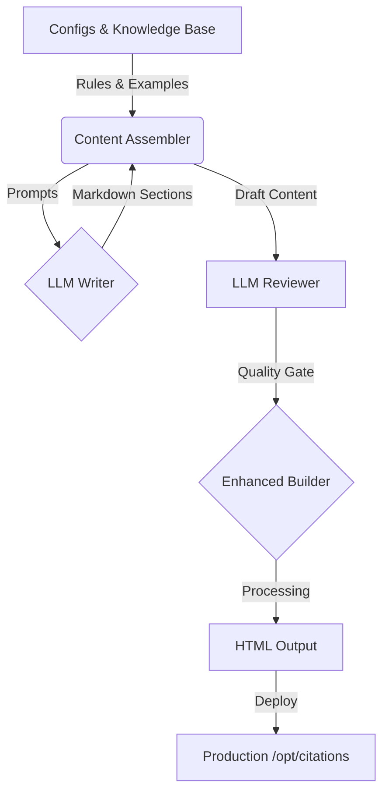

# PSEO System Engineering Documentation

**System Status**: Production-Ready
**Core Function**: Programmatic generation of high-SEO-value citation guides with interactive tools.

## 1. High-Level Architecture

The PSEO system is a custom **Static Site Generation (SSG)** pipeline specialized for "Hybrid" content (Static Text + Interactive React Mini-Apps).



## 2. Core Components

### 2.1 Content Assembler (`backend/pseo/generator/`)
The orchestrator. It combines three inputs to create a "Guide":
1.  **Static Templates**: Jinja2 structure (`backend/pseo/templates/`).
2.  **Knowledge Base**: JSON facts (`backend/pseo/knowledge_base/`) containing APA rules, common errors, and validated examples.
3.  **LLM Generation**: Dynamic, unique content (Intros, FAQs, specific instructions) generated via `LLMWriter`.

### 2.2 Component System (`backend/pseo/builder/components.py`)
Unlike standard SSGs, we use a **Custom Component System** injected *before* Markdown processing. This allows rich UI elements in static text.

| Component Syntax | Renders To | Python Class |
| :--- | :--- | :--- |
| `` | `<div class="tldr-box">` | `TLDRBoxComponent` |
| `` | Interactive Validation App | `MiniCheckerComponent` |
| `` | Formatted Code Block | `CitationExampleComponent` |
| `` | Before/After Comparison | `ErrorExampleComponent` |

**Developer Note**: When creating templates, use these tags. The `EnhancedStaticSiteGenerator` parses them using regex and delegates rendering to the appropriate Python class.

### 2.3 Enhanced Builder (`backend/pseo/builder/enhanced_static_generator.py`)
**Crucial**: Do not use the legacy `static_generator.py`. The **Enhanced** version performs:
-   **Semantic Wrapping**: Automatically wraps `<h2>` sections in `<section>` tags for SEO.
-   **Component Processing**: Expands the custom tags above.
-   **Mini-Checker Injection**: Places the `async function checkCitation` logic and UI hooks.
-   **Sidebar Generation**: Auto-generates navigation sidebars for "Mega Guides".

### 2.4 Automated QA (`backend/pseo/review/llm_reviewer.py`)
An automated agent that acts as a gatekeeper. It checks:
-   **Structural Integrity**: Missing required sections (e.g., "Validation Checklist").
-   **Technical Health**: Heading hierarchy (H1 -> H2), broken internal links.
-   **SEO**: Meta title/description lengths.
-   **Quality**: Uses an LLM to grade "Tone", "Clarity", and "Accuracy" of the generated text.

## 3. Data Sources

### Configuration (`backend/pseo/configs/`)
-   `specific_sources.json`: The "Long Tail" targets (YouTube, Netflix, Wikipedia).
-   `mega_guides.json`: The "Head" terms (APA Guide, Reference List).
-   `source_type_guides.json`: The "Middle" terms (Journal, Book, Website).

### Knowledge Base (`backend/pseo/knowledge_base/`)
**Source of Truth**. Do not hardcode rules in Python.
-   `citation_rules.json`: Official APA 7th edition rules.
-   `common_errors.json`: Database of specific mistakes (e.g., "YouTube video missing upload date").
-   `examples.json`: Validated examples used for "Few-Shot" prompting and static display.

## 4. Content Types

| Type | URL Pattern | Purpose | Key Features |
| :--- | :--- | :--- | :--- |
| **Specific Source** | `/cite-{slug}-apa/` | Long-tail traffic | Highly specific instructions, Pre-filled Mini-Checker examples. |
| **Source Type** | `/how-to-cite-{slug}-apa/` | Broad category traffic | comprehensive tables, multiple variation examples. |
| **Mega Guide** | `/guide/{slug}/` | Authority building | 2000+ words, Table of Contents, Sticky Sidebar. |
| **Validation** | `/{slug}/` | Specific problem solving | Focus on "Fixing" (e.g., "how to fix capitalization"). |

## 5. Deployment & Automation

### Production Deployment
**Host**: `178.156.161.140`
**Path**: `/opt/citations/frontend/frontend/dist/`

### Primary Scripts (`backend/`)

| Script | Purpose | When to Use |
| :--- | :--- | :--- |
| `regenerate_cite_specific_pages.py` | **Production Updates** | Use this to rebuild/update the `cite-*` pages. Applies the "Golden Template". |
| `pseo/scripts/generate_single_guide.py` | **Dev / Testing** | Generates one specific guide to `test_output/` for manual review. |
| `pseo/scripts/batch_generate_all_mega_guides.py` | **Bulk Creation** | Heavy operation. Generates full suite of Mega Guides. |
| `pseo/scripts/preview_guide_html.py` | **Visual QA** | Spins up a local server to preview generated HTML. |

### Deployment Checklist
1.  **Generate**: Run generation script (e.g., `regenerate_cite_specific_pages.py`).
2.  **Verify**: Check `test_output/cite_pages_updated/` for:
    -   `index.html` existence.
    -   Presence of `async function checkCitation`.
    -   Presence of `cta-placement` divs (Mini-Checker).
3.  **Upload**:
    ```bash
    scp -r test_output/cite_pages_updated/cite-{source}-apa/ deploy@178.156.161.140:/opt/citations/frontend/frontend/dist/
    ```
4.  **Sitemap**: Run `backend/pseo/utils/sitemap_generator.py` to register new URLs.

## 6. CSS & Styling
The system relies on a unified CSS structure expected by the `EnhancedStaticSiteGenerator`.
-   **Classes**: `.tldr-box`, `.mini-checker`, `.citation-example`, `.error-example`.
-   **Layout**: The builder wraps content in semantic `<section>` tags which are targeted by the global CSS for spacing and layout.

## 7. Troubleshooting

-   **"Mini-Checker not showing"**: Check if `` tag was in the template. Check if `EnhancedStaticSiteGenerator` was used (Legacy builder ignores these tags).
-   **"Template variables not replaced"**: The `ContentAssembler` validation step usually catches this, but check if `{{ variable }}` syntax matches the dictionary keys in `content_assembler.py`.
-   **"Content too short"**: The `LLMReviewer` flagged it. Check `llm_writer.py` prompts or OpenAI API limits.

---
**Maintenance Note**: When adding a new "Source", add it to `specific_sources.json` and ensure a corresponding "Parent Type" exists in `knowledge_base/inheritance/` to inherit general rules.